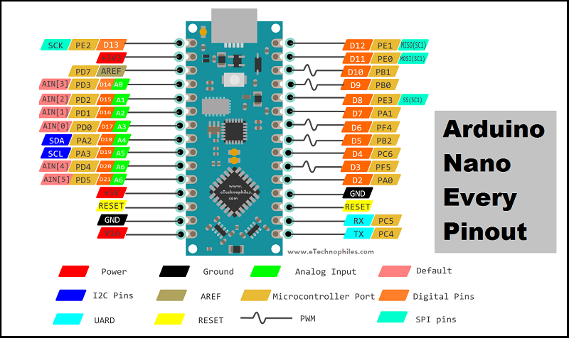
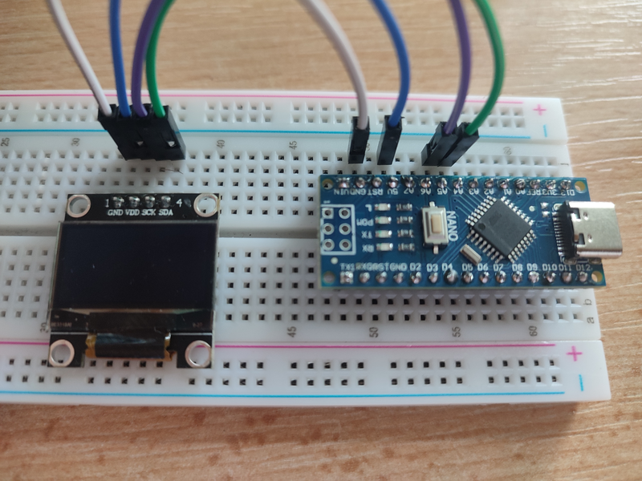
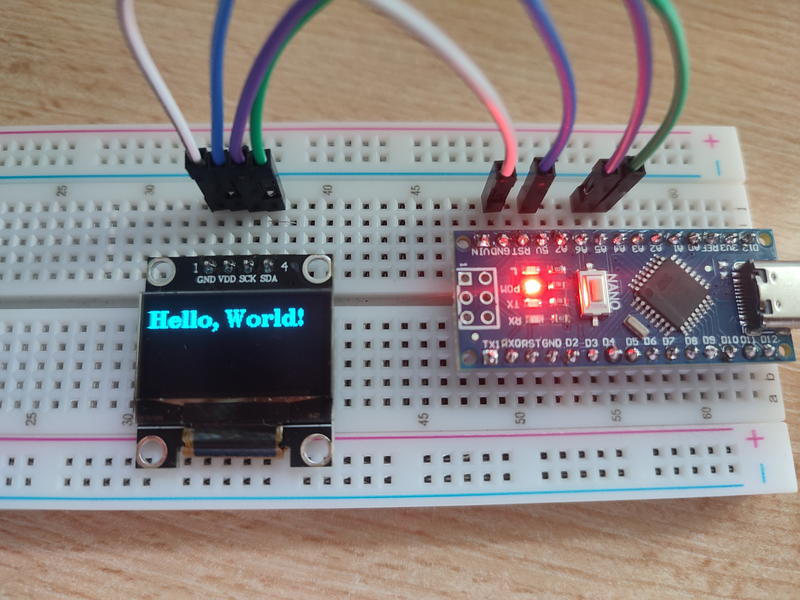

# Setup

I bought a small 128x64 OLED from AliExpress for a project I plan on realizing. Many of these Chinese components 
don't have good user instructions in English if any. With this blog post I want to show you how to connect such a 
display to an Arduino board.

For this setup we will need:
* 128x64 I2C OLED - or any other with I2C communication
* an Arduino board - I am using an Arudino Nano
* breadboard
* jumper cables
* Arduino IDE

## Connecting Hardware

We first need to connect power lines from Arduino to the OLED. This display takes voltages from 3.3V to 5V. I decided 
to use the 5V line. Just connect the 5V pin on Arduino to VDD on OLED and Ground to Ground. For connecting the next set 
of pins we will need to understand how I2C communication works

### I2C

I2C is a serial communication protocol meaning it uses one wire for transfer of data. Apart from that wire it uses a 
clock wire to synchornize data transfer. This wires (lines) are called SDA (for data) and SCL (for clock). 
This protocol is a master-slave protocol, meaning we have one device acting as a master - sending and receiving data, 
and other devices acting as slaves - being controlled by master.

Each device on I2C bus has its own unique address. This allows us to talk to a specific device when sending data.

Now we need to connect I2C pins on our arduino and our OLED. You will need to find where these pins are located on your Arduino 
model, for me they are pins A4 (SDA), A5 (SCL).



To connect these pins to our OLED we need to connect A4 to SDA on OLED, and A5 to SCK (another name for SCL).

Here is how our circuit should look:



## Writing Code

To interact with our OLED we will use a library called `U8g2`, which you can find in Arduino IDE Library Menager. We then include this 
library along with `Wire` library which is used for I2C communication. 
```arduino
#include <U8g2lib.h>
#include <Wire.h>
```

Then we initialize a global variable which represents our OLED. I used `U8G2_SSD1306_128x64_VCOMH0_F_HW_I2C` type which I found works best 
for my particular component type. If you buy a different OLED you will need to find a type that works for it. You can find a list of those 
types here: [https://github.com/olikraus/u8g2/wiki/u8g2setupcpp](https://github.com/olikraus/u8g2/wiki/u8g2setupcpp)
```arduino
U8G2_SSD1306_128x64_VCOMH0_F_HW_I2C oled(U8G2_R0);
```

In `setup` we just begin our communication by calling `oled.begin()` 
```arduino
void setup() 
{
  oled.begin()
}
```

In `loop` we do the actual printing on the screen. First we clear the buffer, then set the font, draw something and send that buffer. We then delay 
so we don't overload the OLED.
```arduino
void loop()
{
  oled.clearBuffer();
  oled.setFont(u8g2_font_ncenB18_tr);
  oled.drawStr(0, 20, "Hello world");
  oled.sendBuffer();
  delay(2000);
}
```

You are not limited to just drawing strings, you can also draw boxes, buttons, circles ... You can find how to do all that and more at the official documentation: 
[https://github.com/olikraus/u8g2/wiki/u8g2reference](https://github.com/olikraus/u8g2/wiki/u8g2reference)

Our final code looks like this:
```arduino
#include <U8g2lib.h>
#include <Wire.h>

U8G2_SSD1306_128x64_VCOMH0_F_HW_I2C oled(U8G2_R0);

void setup() 
{
  oled.begin()
}

void loop()
{
  oled.clearBuffer();
  oled.setFont(u8g2_font_ncenB18_tr);
  oled.drawStr(0, 20, "Hello, World!");
  oled.sendBuffer();
  delay(2000);
}
```

We upload this and get our wanted result:


