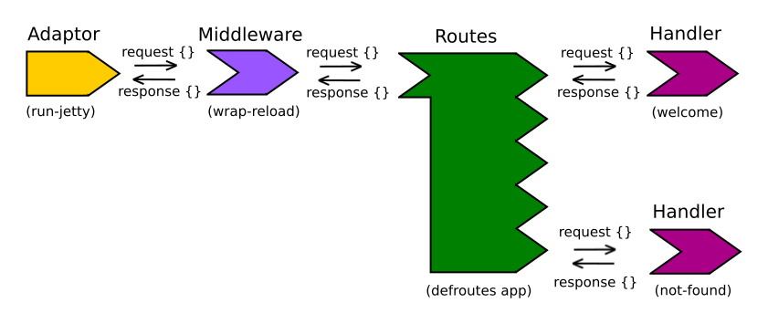

# Routing Requests with Ring

Ring is the de facto standard HTTP library for Clojure. Because of this there are many 
tools built on top of it so we will rarely be using it directly. However it is important 
to learn how it works so we can make better applications.

Ring applications consist of four components:
1. the request - an HTTP request transformed to Ring request by the adapter sent to middleware
2. the middleware - modifies the Ring request as necessary, until it reaches the handler
3. the handler - generates a Ring reponse from the request and sends it to middleware 
4. the response - an HTTP response generated from the response map by the adapter

Here is a picture of this process and components to better understand:

(taken from [https://practical.li/blog/posts/webapp-routes-with-json/](https://practical.li/blog/posts/webapp-routes-with-json/))

## Creating a Web Server

Lets create a ring demo app and add Ring as a dependancy:
```bash
lein new ring-demo
```
```clojure
; ring-demo/project.clj
(defproject ring-demo "0.1.0-SNAPSHOT"
  :description "FIXME: write description"
  :url "http://example.com/FIXME"
  :license {:name "EPL-2.0 OR GPL-2.0-or-later WITH Classpath-exception-2.0"
            :url "https://www.eclipse.org/legal/epl-2.0/"}
  :dependencies [[org.clojure/clojure "1.11.1"]
                 [ring "1.9.6"]]
  :repl-options {:init-ns ring-demo.core}
  :main ring-demo.core)
```

## Handling requests

To handle incoming requests we will need a handler function that takes a request and 
return a response map. We can create one like this:
```clojure
; ring-demo/src/ring-demo/core.clj
(defn handler 
  [request-map]
  {:status 200
   :header {"Content-Type" "text/html"}
   :body "<html><body>Hello World</body></html>"
    })
```

We then need to start our web server with the handler. For this we can use Ring's jetty adapter.
```clojure
; ring-demo/src/ring-demo/core.clj
(ns ring-demo.core
  (:require [ring.adapter.jetty :as jetty]))

(defn handler 
  [request-map]
  {:status 200
   :header {"Content-Type" "text/html"}
   :body "<html><body>Hello World</body></html>"
    })

(defn -main 
  []
  (jetty/run-jetty
    handler
    {:port 3000
     :join? false})) ; runs in another thread so REPL doesn't block
```

To run our code we can use `lein run` or just execute `-main` in the REPL. We can now see 
our Hello World string when we go to `localhost:3000`.

Because sending HTML with response code 200 is a common task, Ring provides `ring.util.response/response` 
function to shorten the syntax. We can use it as:
```clojure
; ring-demo/src/ring-demo/core.clj
(ns ring-demo.core
  (:require [ring.adapter.jetty :as jetty]
            [ring.util.response :as response]
  ))

(defn handler 
  [request-map]
  (response/response 
    "<html><body>Hello World</body></html>"))
```

## Middleware

Middleware is used to wrap the handlers in functions that can modify both the response and/or 
the request. These functions take a handler and return a new handler with some added behaviour. 
Here is an example:
```clojure
; ring-demo/src/ring-demo/core.clj
(defn wrap-nocache
  [handler]
  (fn [request]
    (-> request
         handler
         (assoc-in [:headers "Cache-Control"] "no-cache"))))
```

To add this middlware we just change our main function:
```clojure
; ring-demo/src/ring-demo/core.clj
(defn -main
  []
  (jetty/run-jetty
    (-> handler
         wrap-nocache)
    {:port 3000
     :join? false})) ; runs in another thread so REPL doesn't block
```

We can see our header is in place
```bash
curl -I localhost:3000
  HTTP/1.1 200 OK
  ...
  Cache-Control: no-cache
```
